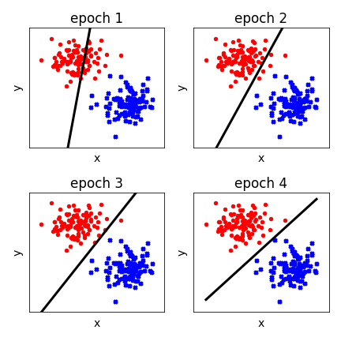

# Rosenblatt's Perceptron (1958)

## Perceptron model for supervised machine learning

### Table of Contents

- [Images](#images)
- [Description](#description)
- [Keywords](#keywords)
- [How to Use](#how-to-use)
- [References](#references)
- [Author Info](#author-info)

## Images

## Description

"Perceptron model for supervised machine learning."

#### Technologies

- Python programming language

## Keywords

 - Supervised model
 - Single-layer feedforward architecture
 - Linear classification
 - Bipolar target patterns
 - Gradient descent
 - Activation function
 - Learning rate
 - Weights
 - Bias

## How to Use

#### Getting started

`git clone https://github.com/berberianareg/Linear-perceptron.git`

#### Dependencies

see requirements.txt

#### Installation

`pip install numpy`

`pip install matplotlib`

#### Executing the program from command line

`python Perceptron.py`

#### API Reference

## References

#### Links

- Wikipedia - (https://en.wikipedia.org/wiki/Perceptron)
- Relevant paper - (https://psycnet.apa.org/record/1959-09865-001)

## Author Info

- Twitter - [@berberianareg](https://twitter.com/BerberianNareg)
- LinkedIn - [Nareg Berberian](https://www.linkedin.com/in/nareg-berberian-phd-ab6759b9/)

[Back to the Top](#project-title)

